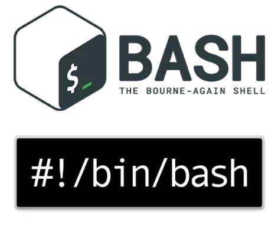

# Linux Shell编程

 

```
Shell 是一个用 C 语言编写的程序，它是用户使用 Linux 的桥梁。Shell 既是一种命令语言，又是一种程序设计语言。

Shell 是指一种应用程序，这个应用程序提供了一个界面，用户通过这个界面访问操作系统内核的服务。

Ken Thompson 的 sh 是第一种 Unix Shell，Windows Explorer 是一个典型的图形界面 Shell。
```


## 本仓库内容

1. shell脚本编程学习笔记

```
Something I hope you know before go into the coding~
First, please watch or star this repo, I'll be more happy if you follow me.
Bug report, questions and discussion are welcome, you can post an issue or pull a request.
```

## 相关站点

* GitBook:<https://yifengyou.gitbooks.io/learn-shell/content/>
* GitHub:<https://github.com/yifengyou/learn-shell/>
* GitPage:<https://yifengyou.github.io/learn-shell/>

## 参考书目

* 《Linux命令行与Shell脚本编程大全》
* 《精通UNIX.shell脚本编程》
* 《实战LINUX_SHELL编程与服务器管理》
* 《Shell脚本编程诀窍——适用于Linux、Bash等》


## 目录

* [shell简介](docs/shell简介.md)
* [shell原理](docs/shell原理.md)
    * [命令的结束状态](docs/shell原理/命令的结束状态.md)
* [环境变量](docs/环境变量.md)
    * [变量类型](docs/环境变量/变量类型.md)
    * [shell保留关键字](docs/环境变量/shell保留关键字.md)
    * [变量赋值](docs/环境变量/变量赋值.md)
    * [位置参数](docs/环境变量/位置参数.md)
    * [删除变量](docs/环境变量/删除变量.md)
    * [预定义变量](docs/环境变量/预定义变量.md)
    * [标准变量](docs/环境变量/标准变量.md)
    * [特殊变量](docs/环境变量/特殊变量.md)
* [数据类型](docs/数据类型.md)
    * [字符串](docs/数据类型/字符串.md)
      * [字符串截取与拼接](docs/数据类型/字符串/字符串截取与拼接.md)
* [bash内置命令](docs/bash内置命令.md)
    * [alias](docs/bash内置命令/alias.md)
    * [buildin](docs/bash内置命令/buildin.md)
    * [compgen](docs/bash内置命令/compgen.md)
    * [declare](docs/bash内置命令/declare.md)
    * [exec](docs/bash内置命令/exec.md)
    * [echo](docs/bash内置命令/echo.md)
    * [exit](docs/bash内置命令/exit.md)
    * [set](docs/bash内置命令/set.md)
    * [let](docs/bash内置命令/let.md)
    * [test](docs/bash内置命令/test.md)
    * [history](docs/bash内置命令/history.md)
    * [pwd](docs/bash内置命令/pwd.md)
    * [cd](docs/bash内置命令/cd.md)
    * [readonly](docs/bash内置命令/readonly.md)
    * [command](docs/bash内置命令/command.md)
    * [shift](docs/bash内置命令/shift.md)
    * [true](docs/bash内置命令/true.md)
    * [false](docs/bash内置命令/false.md)
    * [umask](docs/bash内置命令/umask.md)
    * [ulimit](docs/bash内置命令/ulimit.md)
    * [getopts](docs/bash内置命令/getopts.md)
    * [shopt](docs/bash内置命令/shopt.md)
    * [read](docs/bash内置命令/read.md)
    * [help](docs/bash内置命令/help.md)
* [流程控制](docs/流程控制.md)
    * [判断](docs/流程控制/判断.md)
        * [if](docs/流程控制/判断/if.md)
        * [case](docs/流程控制/判断/case.md)
    * [循环](docs/流程控制/循环.md)
        * [for](docs/流程控制/循环/for.md)
        * [while](docs/流程控制/循环/while.md)
        * [until](docs/流程控制/循环/until.md)
        * [continue](docs/流程控制/循环/continue.md)
        * [break](docs/流程控制/循环/break.md)
    * [select命令](docs/流程控制/select命令.md)
* [函数](docs/函数.md)
* [正则表达式与模式匹配](docs/正则表达式与模式匹配.md)
* [文本三剑客](docs/文本三剑客.md)
    * [sed](docs/文本三剑客/sed.md)
    * [gawk](docs/文本三剑客/gawk.md)
    * [grep](docs/文本三剑客/grep.md)
* [文本编辑器](docs/文本编辑器.md)
    * [vim](docs/文本编辑器/vim.md)
    * [nano](docs/文本编辑器/nano.md)
    * [emacs](docs/文本编辑器/emacs.md)

## 总结

  1. 基础永远值得花费90%的精力去学习加强。厚积而薄发~
  2. 实践的重要性
