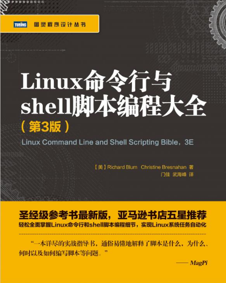

# Linux Shell编程

## 仓库介绍

本仓库已经开始作为GitBook仓库，访问地址

<https://yifengyou.gitbooks.io/learn-shell/content/>

GitHub访问地址

<https://github.com/yifengyou/learn-shell/>

```
Something I hope you know before go into the coding~
First, please watch or star this repo, I'll be more happy if you follow me.
Bug report, questions and discussion are welcome, you can post an issue or pull a request.
```

## 参考书目

《Linux命令行与Shell脚本编程大全》



## 目录

* [Shell](README.md)
* [第1章-初识Linux_shell](第1章-初识Linux_shell/第1章-初识Linux_shell.md)
* [第2章-走进shell](第2章-走进shell/第2章-走进shell.md)
* [第3章-基本的bash_shell命令](第3章-基本的bash_shell命令/第3章-基本的bash_shell命令.md)
* [第4章-更多的bash_shell命令](第4章-更多的bash_shell命令/第4章-更多的bash_shell命令.md)
* [第5章-理解shell](第5章-理解shell/第5章-理解shell.md)
* [第6章-使用Linux环境变量](第6章-使用Linux环境变量/第6章-使用Linux环境变量.md)
* [第7章-理解Linux文件权限](第7章-理解Linux文件权限/第7章-理解Linux文件权限.md)
* [第8章-管理文件系统](第8章-管理文件系统/第8章-管理文件系统.md)
* [第9章-安装软件程序](第9章-安装软件程序/第9章-安装软件程序.md)
* [第10章-使用编辑器](第10章-使用编辑器/第10章-使用编辑器.md)
* [第11章-构建基本脚本](第11章-构建基本脚本/第11章-构建基本脚本.md)
* [第12章-使用结构化命令](第12章-使用结构化命令/第12章-使用结构化命令.md)
* [第13章-更多的结构化命令](第13章-更多的结构化命令/第13章-更多的结构化命令.md)
* [第14章-处理用户输入](第14章-处理用户输入/第14章-处理用户输入.md)
* [第15章-呈现数据](第15章-呈现数据/第15章-呈现数据.md)
* [第16章-控制脚本](第16章-控制脚本/第16章-控制脚本.md)
* [第17章-创建函数](第17章-创建函数/第17章-创建函数.md)
* [第18章-图形化桌面环境中的脚本编程](第18章-图形化桌面环境中的脚本编程/第18章-图形化桌面环境中的脚本编程.md)
* [第19章-初识sed和gawk](第19章-初识sed和gawk/第19章-初识sed和gawk.md)
* [第20章-正则表达式](第20章-正则表达式/第20章-正则表达式.md)
* [第21章-sed进阶](第21章-sed进阶/第21章-sed进阶.md)
* [第22章-gawk进阶](第22章-gawk进阶/第22章-gawk进阶.md)
* [第23章-使用其他shell](第23章-使用其他shell/第23章-使用其他shell.md)
* [第24章-编写简单的脚本实用工具](第24章-编写简单的脚本实用工具/第24章-编写简单的脚本实用工具.md)
* [第25章-创建与数据库_Web及电子邮件相关的脚本](第25章-创建与数据库_Web及电子邮件相关的脚本/第25章-创建与数据库_Web及电子邮件相关的脚本.md)
* [第26章-一些小有意思的脚本](第26章-一些小有意思的脚本/第26章-一些小有意思的脚本.md)
* [勘误](勘误/勘误.md)


## 总结

  1. 基础永远值得花费90%的精力去学习加强。厚积而薄发~
  2. 实践的重要性
