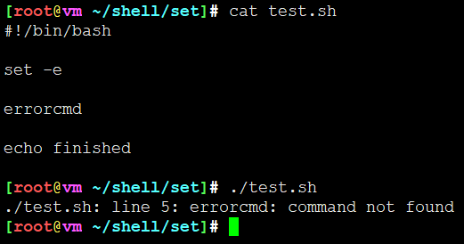
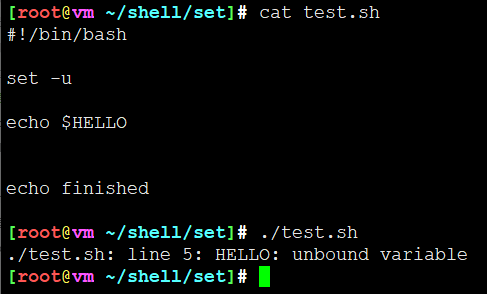
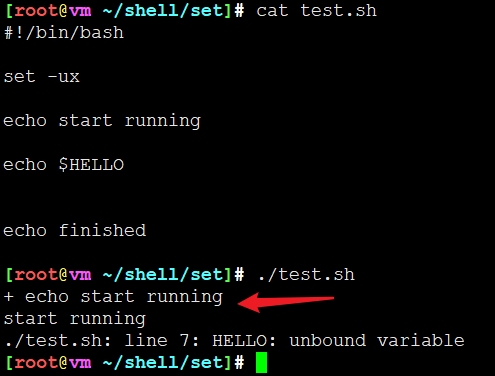
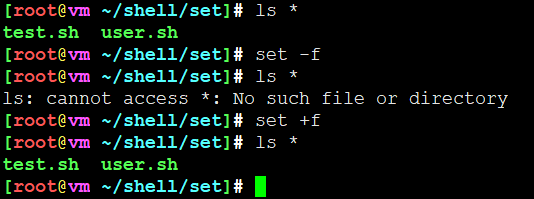
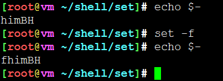

<!-- MDTOC maxdepth:6 firsth1:1 numbering:0 flatten:0 bullets:1 updateOnSave:1 -->

- [set](#set)   
   - [基本语法](#基本语法)   
   - [选项](#选项)   
   - [实例](#实例)   
      - [不带参数的set命令用来显示环境变量](#不带参数的set命令用来显示环境变量)   
      - [遇到错误就退出 -e 或者 -o errexit](#遇到错误就退出-e-或者-o-errexit)   
      - [遇到不存在的变量就退出 -u 或者 -o nounset](#遇到不存在的变量就退出-u-或者-o-nounset)   
      - [执行的时候输出对应的命令 -x 或者 -o xtrace](#执行的时候输出对应的命令-x-或者-o-xtrace)   
      - [关闭模式匹配 -f  或者 -o noglob](#关闭模式匹配-f-或者-o-noglob)   
   - [参考](#参考)   

<!-- /MDTOC -->
# set

set命令是 Bash 脚本的重要环节，却常常被忽视，导致脚本的安全性和可维护性出问题。本文介绍它的基本用法，让你可以更安心地使用 Bash 脚本。

## 基本语法

```
set [+-abCdefhHklmnpPtuvx]
```

## 选项

| 选项           | 说明                                                     |
| -------------- | -------------------------------------------------------- |
| -a             | 显示修改的变量                                           |
| -u /-o nounset | 遇到不存在的变量报错并退出执行                           |
| -x /-o xtrace  | 调试输出，执行命令前先输出完整命令                       |
| -e /-o errexit | 执行遇到错误就退出。若指令传回值不等于0，则立即退出shell |
| -eo pipefail   | 只要一个子命令失败，管道命令失败，脚本终止执行           |
| -euxo pipefial | 遇到不存在变量退出，执行错误退出，管道失败退出，调试输出 |

## 实例

### 不带参数的set命令用来显示环境变量


### 遇到错误就退出 -e 或者 -o errexit



* 遇到不存在命令执行错误退出，后序命令不执行

### 遇到不存在的变量就退出 -u 或者 -o nounset



* HELLO变量未定义，后序命令未执行

### 执行的时候输出对应的命令 -x 或者 -o xtrace



* 对应的命令会以+开头形式输出

### 关闭模式匹配 -f  或者 -o noglob



* 关闭就是-f
* 开启就是+f



* 通过特殊环境变量$-来查看set的标记

## 参考

* <https://www.runoob.com/linux/linux-comm-set.html>
* <http://www.ruanyifeng.com/blog/2017/11/bash-set.htmld>
